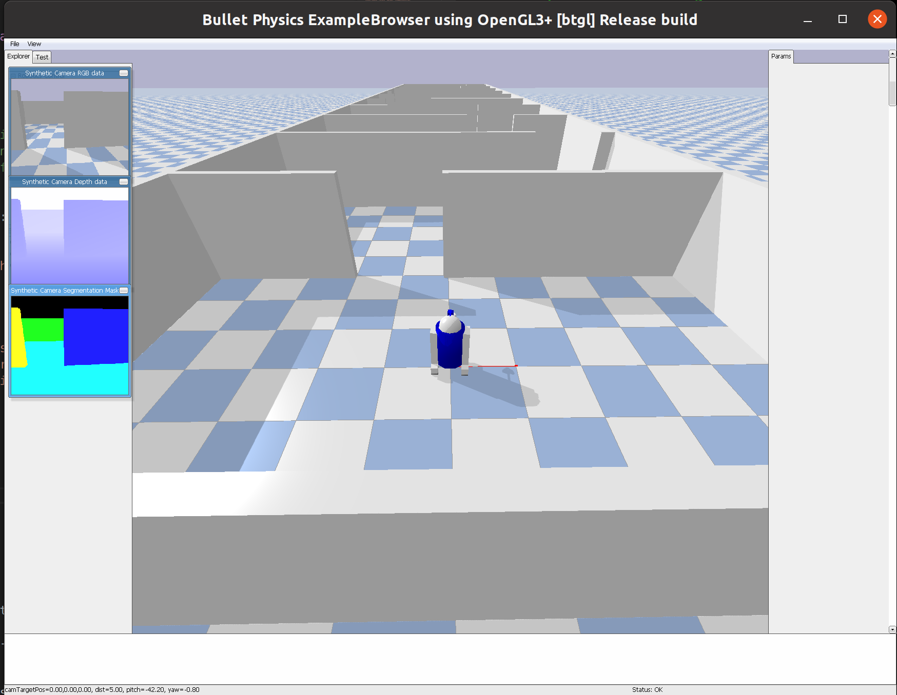

# R2D2Escape

R2D2 Escape is a reinforcement learning environment built using the pybullet physics simulator. 

In this environment there is an agent, R2D2, who has to get to the end of a hallway that has randomly generated obstacles. The agent uses images to determine the actions that it should take that will maximize its reward. In the current implementation, the reward is equal to the distance that the agent moved along the main axis of the hallway during the previous timestep. 
